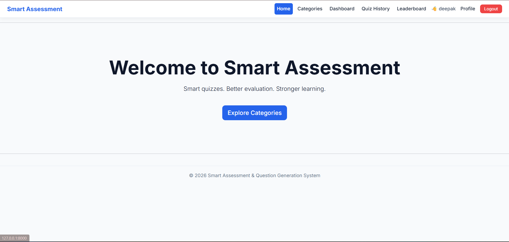
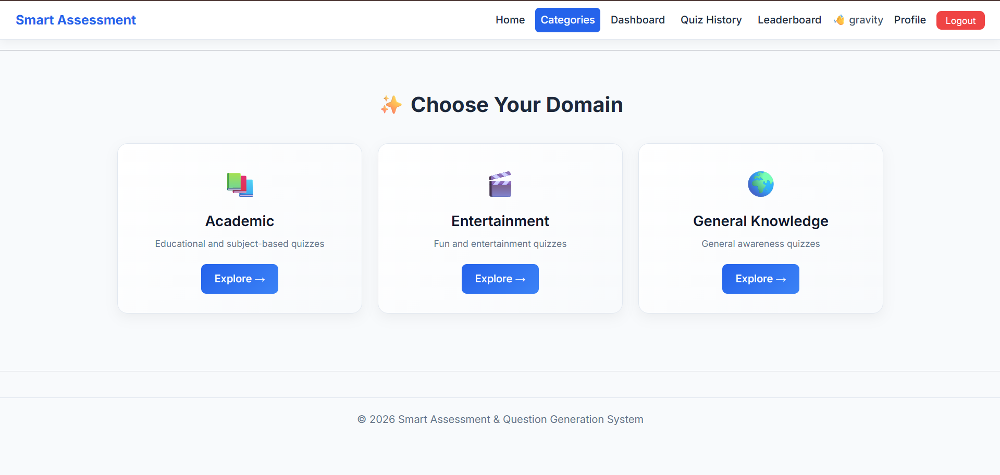
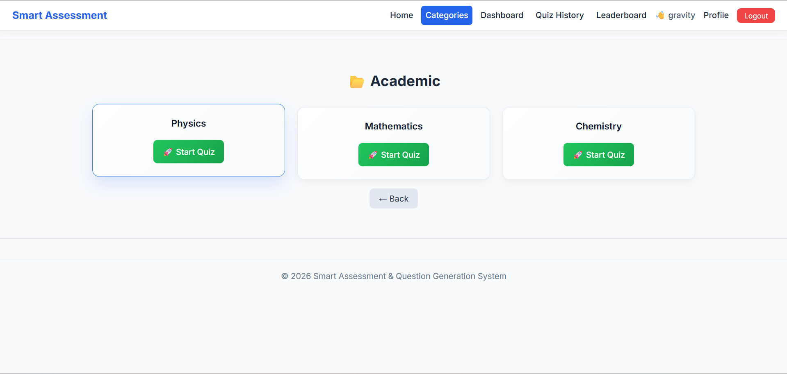
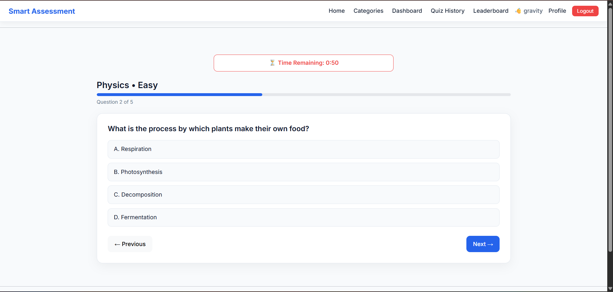
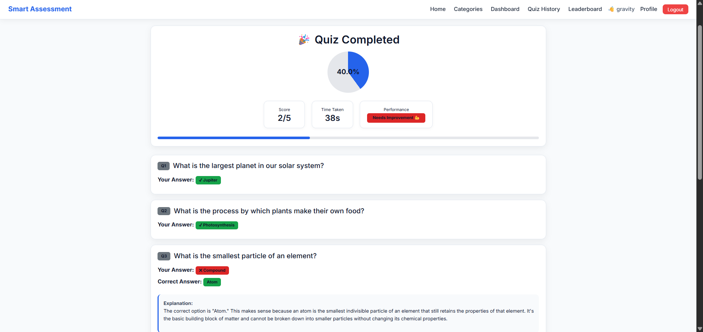
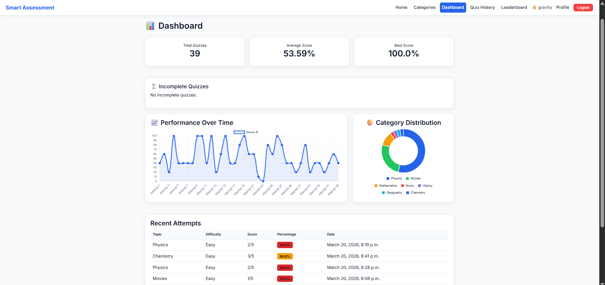
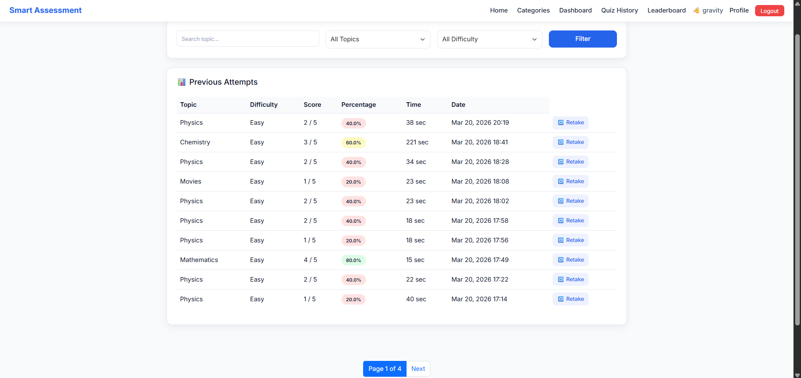
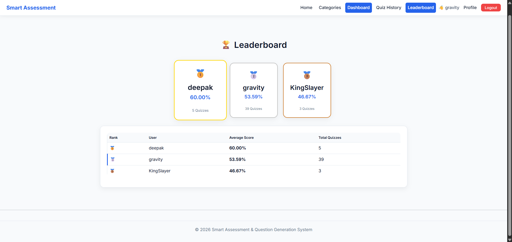
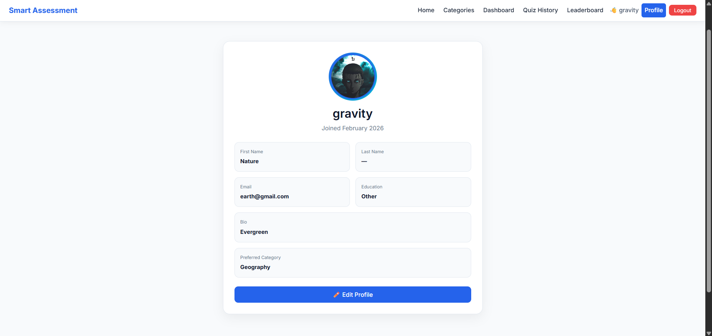
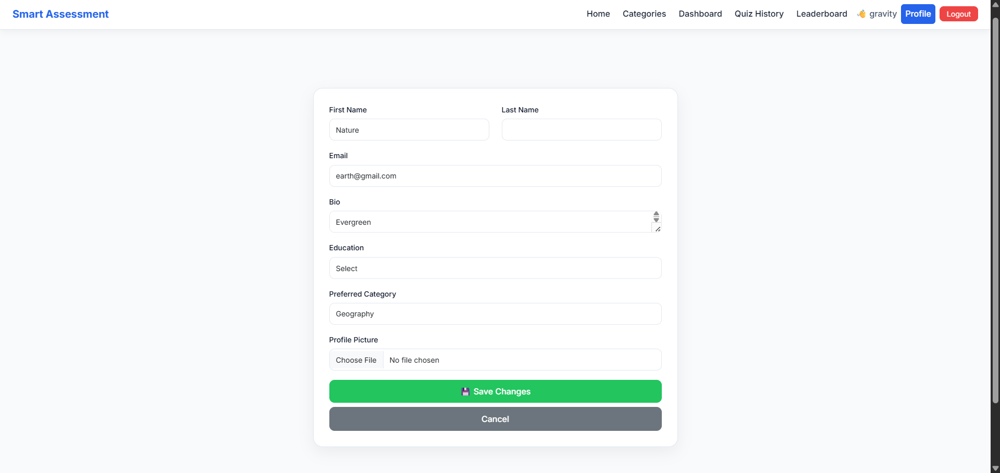

# 🧠 Smart Assessment & AI Question Generation System


## 📌 Overview

Smart Assessment & AI Question Generation System is a full-stack AI-powered quiz platform built using Django.

The system automatically generates intelligent quiz questions using Generative AI, evaluates user performance, tracks progress, and provides detailed analytics.

This project was developed as part of **Infosys Springboard Virtual Internship 6.0 (Batch 13)** and was selected for the **Final Project Presentation** among participating teams.


## 🌐 Live Application

🔗 https://smart-assessment.onrender.com/


## ✨ Key Features


## 🔐 User Authentication

✔ User Registration  
✔ Secure Login & Logout  
✔ Session Management  
✔ Profile Management  
✔ Profile Image Upload


## 🤖 AI Question Generation

✔ Dynamic question generation  
✔ Powered by Groq API + LLaMA model  
✔ Category-based quizzes  
✔ Difficulty levels:
- Easy
- Medium
- Hard

✔ Custom question generation


## 📝 Smart Quiz System

✔ Interactive quiz interface  
✔ Timer-based assessments  
✔ Auto submission after timeout  
✔ Real-time answer tracking  
✔ Instant result generation


## 📊 Result Analysis

✔ Score calculation  
✔ Percentage evaluation  
✔ Correct/Wrong answer comparison  
✔ Performance feedback  
✔ Time tracking


## 📈 Analytics Dashboard

✔ Total quizzes attempted  
✔ Average score tracking  
✔ Best performance record  
✔ Performance graph visualization  
✔ Category-wise analysis


## 📚 Quiz History

✔ Previous attempt records  
✔ Search & filter quizzes  
✔ Score history  
✔ Retake quiz option


## 🏆 Leaderboard

✔ User ranking system  
✔ Average score comparison  
✔ Total quiz count tracking


## 🌗 Modern UI Experience

✔ Responsive design  
✔ Light/Dark mode  
✔ Premium dashboard UI  
✔ Mobile friendly interface


# 🛠 Tech Stack

### Backend
- Python
- Django

### Frontend
- HTML5
- CSS3
- JavaScript
- Bootstrap

### AI Integration
- Groq API
- LLaMA Model

### Database
- SQLite

---

# 📂 Project Architecture

```
Smart-Assessment/
│
├── 📂 dashboard/                 # Dashboard application
│   ├── admin.py
│   ├── apps.py
│   ├── models.py
│   ├── urls.py
│   └── views.py
│
├── 📂 quizzes/                   # Quiz management application
│   ├── admin.py
│   ├── apps.py
│   ├── models.py
│   ├── urls.py
│   ├── utils.py                  # Quiz generation utilities
│   └── views.py
│
├── 📂 users/                     # User authentication & profiles
│   ├── admin.py
│   ├── apps.py
│   ├── forms.py
│   ├── models.py
│   ├── signals.py
│   ├── urls.py
│   └── views.py
│
├── 📂 smart_assessment/          # Main Django project settings
│   ├── settings.py
│   ├── urls.py
│   ├── asgi.py
│   └── wsgi.py
│
├── 📂 templates/                 # HTML templates
│   │
│   ├── 📂 dashboard/
│   │   ├── dashboard.html
│   │   ├── home.html
│   │   └── leaderboard.html
│   │
│   ├── 📂 quizzes/
│   │   ├── categories.html
│   │   ├── quiz_page.html
│   │   ├── quiz_result.html
│   │   ├── quiz_history.html
│   │   ├── quiz_settings.html
│   │   └── subcategories.html
│   │
│   └── 📂 users/
│       ├── login.html
│       ├── register.html
│       └── profile.html
│
├── 📂 static/                    # Static files
│   └── 📂 css/
│       └── style.css             # Main styling file
│
├── 📂 media/                     # Uploaded user media
│
├── 📂 screenshots/               # Project screenshots
│   ├── home.png
│   ├── categories.png
│   ├── dashboard.png
│   ├── quiz.png
│   ├── result.png
│   ├── leaderboard.png
│   └── profile.png
│
├── manage.py                     # Django management script
│
├── requirements.txt              # Required dependencies
│
├── README.md                     # Project documentation
│
├── LICENSE                       # License file
│
└── .gitignore                    # Ignored files


```


--- 

# ⚙️ Installation


## Clone Repository

```bash
git clone https://github.com/deepakjha018/smart-assessment.git

cd smart-assessment
````

## Create Environment

```bash
python -m venv venv
venv\Scripts\activate
```

## Install Packages

```bash
pip install -r requirements.txt
```

## Setup Environment Variables

Create `.env`

```env
GROQ_API_KEY=your_api_key
```

## Database Setup

```bash
python manage.py migrate
```

## Start Server

```bash
python manage.py runserver
```

# 📸 Project Screenshots


## 🏠 Home Page




## 📚 Category Selection



## 📚 SubCategory Selection




## 🧠 AI Generated Quiz




## 📊 Result Analysis




## 📈 Analytics Dashboard




## 📜 Quiz History




## 🏆 Leaderboard




## 👤 User Profile





# 🎯 Project Highlights

⭐ Real AI powered question generation

⭐ Complete full-stack implementation

⭐ Secure authentication workflow

⭐ User performance analytics

⭐ Interactive dashboard

⭐ Production deployment

# 🏅 Internship Achievement

Developed during:

**Infosys Springboard Virtual Internship 6.0**

Project:
**Intelligent Quiz Management System with Auto Generated Questions**

Achievement:

🏆 Selected for Final Project Presentation among participating internship teams.

# 🚀 Future Improvements

* Voice based quiz interaction
* AI difficulty recommendation
* Personalized learning paths
* Advanced admin analytics

# 👨‍💻 Developer

**Deepak Kumar Jha**

B.Tech Artificial Intelligence & Data Science

GitHub:
[https://github.com/deepakjha018](https://github.com/deepakjha018)

# ⭐ Support

If you found this project useful, consider giving it a ⭐ on GitHub.

```
Made with ❤️ using Python and Machine Learning
```